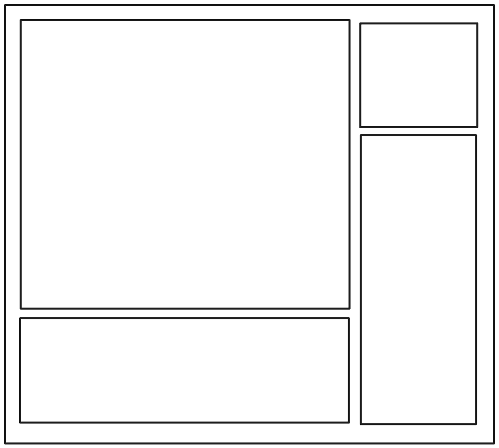

# Lab class of 18/02/2025

**Q1. Make the following layout using HTML and CSS**

[Soultion HTML](./Feb_18_code/q1.html)
[Soultion CSS](./Feb_18_code/q1.css)

**Q2. Make a landing page using HTML and CSS**
[Soultion HTML](./Feb_18_code/q2.html)
[Soultion CSS](./Feb_18_code/q2.css)

The solutions are provided in the [Feb_18_code](./Feb_18_code/)