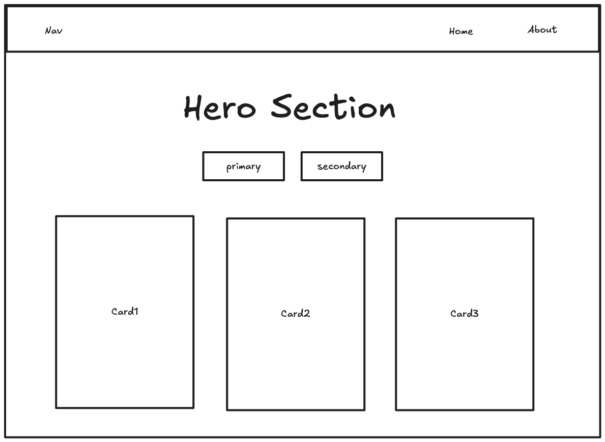

# Practical class of 25/02/2025

This is the practical class questions for 25th February 2025

1. Use bootstrap to create the following layout -

2. Display all the normal and outline buttons of bootstrap and then implement them using normal HTML and CSS