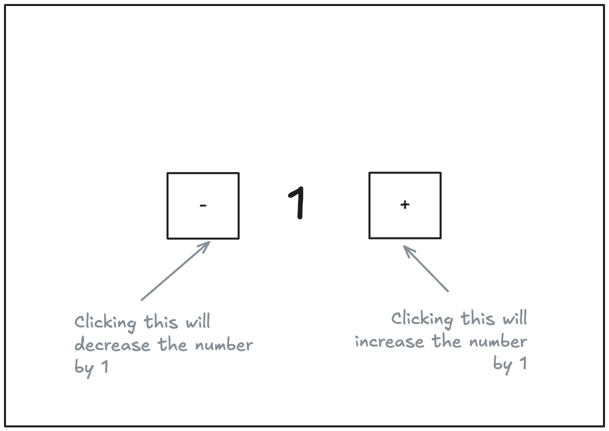

# 18th March 2025 practical class note

### Question: Make a HTML page with the following layout




### Bonus challenge on top of it

Make the number not go below 0


### Learning 

There are two ways to represent a function -

**Normal function**
```js
function f(){
    //functin body
}
```
**arrow function**
```js
f = () => {
    //functin body
}
```